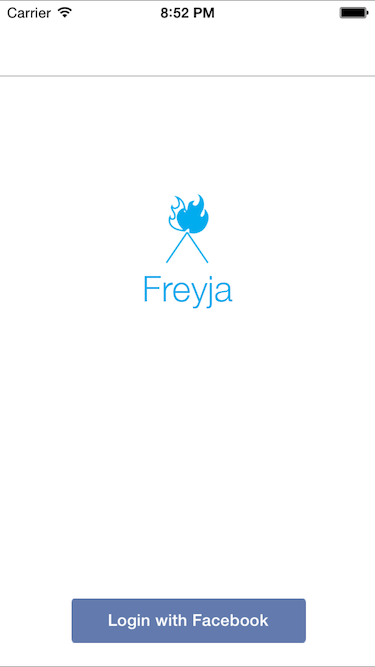

# Freyja
[TFG] Freyja - The iOS Dating App

##Abstract
Ever since the last decade, people have evolved side by side alongside with technology, having an impact in the way we engage, creating new habits, ways of doing, introducing new likes and preferences. Therefore this project focuses on providing an iOS application capable of connecting in a fun way people that can become interesting for you, as it will show people according to the user preferences. Through Freyja, we pretend to facilitate socialization between users using data from their Facebook accounts promoting the veracity and the discovery of other people in a faster way and minimum effort. The application has proved to be more efficient than traditional methods without affecting in its usability. We have successfully completed our project in the scheduled time, delivering a product that solves a real world problem.

##Index Terms
iOS, iPhone, Objective C, Facebook Integration, Parse Integration, Instant Messaging, Dating App. 

###Screens

